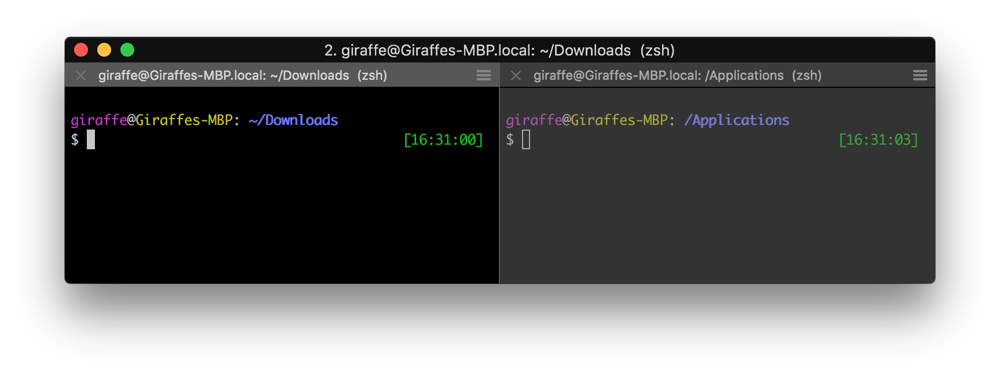

# title-tab for iTerm2 + oh-my-zsh

> This plugin sets the tab title to `username@hostname: full-path (git-branch)` if you're on a git repository or `username@hostname: full-path` if you're not.



## Installing

1. Clone this repository to `/path/to/.oh-my-zsh/custom/plugins` (usually it is on `~/.oh-my-zsh`)

  ```bash
  $ git clone https://github.com/yew/title-tab.git ~/.oh-my-zsh/custom/plugins/title-tab
  ```


2. Edit `.zshrc` file.
  - Find where your zsh plugins are on the `.zshrc` file and add ```title-tab``` to the list.

  ```bash
  plugins=(... title-tab)
  ```
  - Uncomment the following line to disable auto-setting terminal title.
  ```bash
  DISABLE_AUTO_TITLE="true"
  ```

3. Run ```source .zshrc```.

  ```bash
  $ source ~/.zshrc
  ```


And that's it. :)
